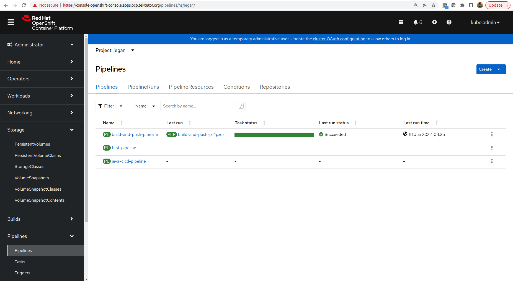
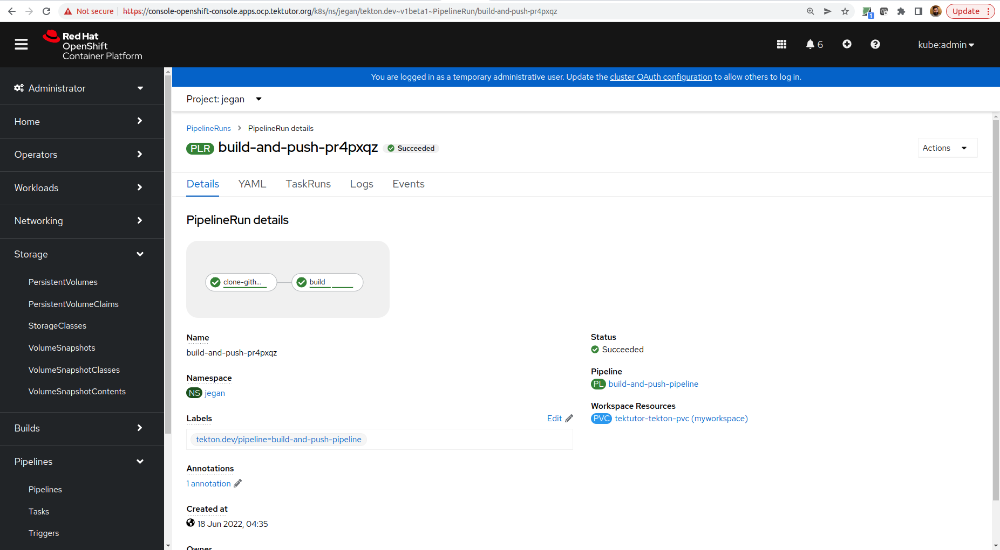
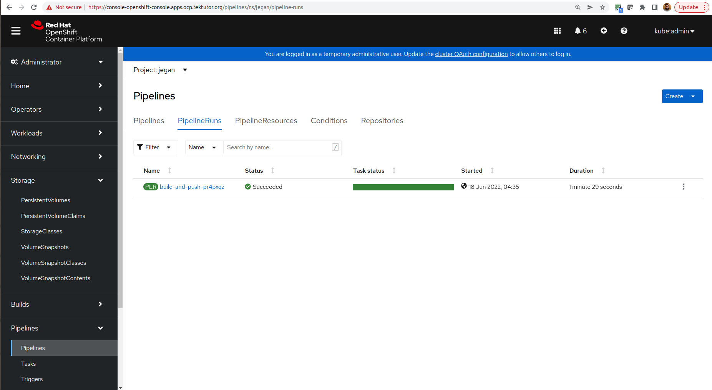
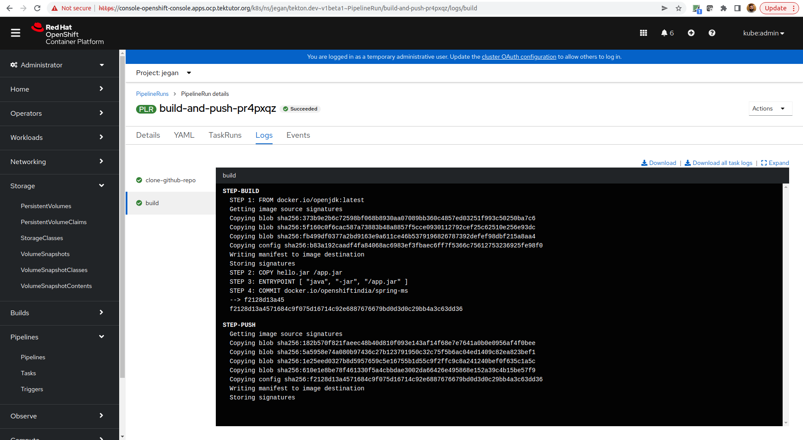
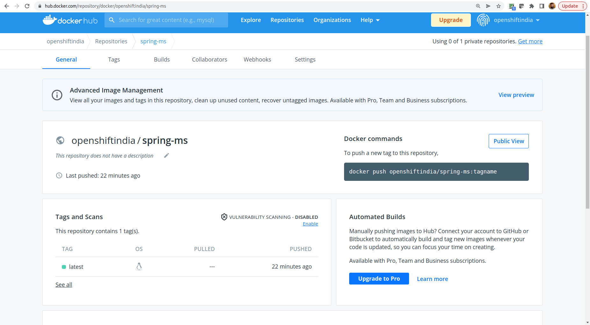

# Day 5

## Tekton Pipeline
- a execution of chain of tasks
- the tasks in a pipeline are executed some in sequence and some in parallel as per our requirement
- output produced by one Task can be passed on to other Task using workspaces with Persisten Volume

## You may be interested in this blog
<pre>
https://medium.com/tektutor/openshift-ci-cd-with-tekton-faa88ba45656
</pre>

## ⛹️‍♂️ Lab - Creating your first pipeline ( as non-admin user )

In case you haven't clone this repository, you may do now
```
cd ~
git clone https://github.com/tektutor/openshift-tekton-june-2022.git
```

Once the code repository is cloned, you may create your first pipeline as shown below
```
cd ~
cd openshift-tekton-june-2022
git pull
cd Day5
oc new-project jegan
oc apply -f first-pipeline.yml
```
Make sure, you have already created a project.  If you have existing project, you can ensure you have switched to your project.

Expected output
<pre>
(jegan@tektutor.org)$ <b>oc apply -f first-pipeline.yml</b>
task.tekton.dev/task1 created
task.tekton.dev/task2 created
pipeline.tekton.dev/first-pipeline created
</pre>

Listing the pipeline
```
tkn pipeline list
```

Executing the pipeline
```
tkn pipeline start first-pipeline
```

Expected output
<pre>
(jegan@tektutor.org)$ <b>tkn pipeline start first-pipeline</b>
PipelineRun started: first-pipeline-run-4mzhs

In order to track the PipelineRun progress run:
tkn pipelinerun logs first-pipeline-run-4mzhs -f -n jegan
</pre>

You may check the pipelinerun output logs as shown below
<pre>
(jegan@tektutor.org)$ <b>tkn pr logs -f first-pipeline-run-4mzhs</b>
[task1 : step1] Task1 - step1

[task1 : step2] Task1 - step2

[task2 : step1] Task2 - step1

[task2 : step2] Task2 - step2

[task2 : step3] Task2 - step3
</pre>


## ⛹️‍♂️ Lab - Creating your second pipeline
```
cd ~
cd openshift-tekton-june-2022
git pull
cd Day5
oc project
oc apply -f second-pipeline.yml
```

Expected ouptut
<pre>
(jegan@tektutor.org)$ oc apply -f second-pipeline.yml 
task.tekton.dev/task1 created
task.tekton.dev/task2 created
task.tekton.dev/task3 created
task.tekton.dev/task4 created
task.tekton.dev/task5 created
pipeline.tekton.dev/second-pipeline created
</pre>

You may start the pipeline execution as shown below
```
tkn pipeline start second-pipeline --showlog
```

Expected output
<pre>
(jegan@tektutor.org)$ tkn pipeline start second-pipeline --showlog
PipelineRun started: second-pipeline-run-pf4xm
Waiting for logs to be available...
[task1 : step1] Task1 - step1

[task1 : step2] Task1 - step2

[task3 : step1] Task3 - step1

[task3 : step2] Task3 - step2

[task2 : step1] Task2 - step1

[task2 : step2] Task2 - step2

[task2 : step3] Task2 - step3

[task4 : step1] Task4 - step1

[task4 : step2] Task4 - step2

[task5 : step1] Task5 - step1

[task5 : step2] Task5 - step2
</pre>

## ⛹️‍♂️ Lab - Create a CI/CD pipeline for a spring-boot java application using Tekton pipeline

You need to install the below tasks from Tekton Hub(Tekton Catalog
```
tkn hub install task maven
tkn hub install task git-clone
```
Without these tasks, our pipeline execution will fail.

Once the git-clone and maven tasks are installed, you can create the pipeline as shown below
```
cd ~
cd openshift-tekton-june-2022
git pull
cd Day5
oc project
oc delete -f java-cicd-pipeline.yml
oc create -f java-cicd-pipeline.yml
```

Expected output
<pre>
(jegan@tektutor.org)$ <b>oc create -f java-cicd-pipeline.yml</b>
persistentvolume/tektutor-tekton-pv-jegan created
persistentvolumeclaim/tektutor-tekton-pvc-jegan created
pipeline.tekton.dev/java-tekton-cicd-pipeline created
pipelinerun.tekton.dev/java-tekton-cicd-pipline-run-wzvjx created
</pre>

You can check the pipelinerun logs in the OpenShift webconsole.

## ⛹️‍♂️ Lab - Build and push images from Dockerfile
#### Create Custom Security Context Constraints to give buildah the permission to perform build and push as root user
```
cd ~
cd openshift-tekton-june-2022
git pull
cd Day5/build-and-deploy/
oc project

oc create -f my-scc.yaml
```

Expected output
<pre>
(jegan@tektutor.org)$ <b>oc create -f my-scc.yml</b>
securitycontextconstraints.security.openshift.io/my-scc created
</pre>

#### Create a Custom Security Account
```
cd ~
cd openshift-tekton-june-2022
git pull
cd Day5/build-and-deploy/
oc project

oc create serviceaccount fsgroup-runasany
```

Expected output
<pre>
(jegan@tektutor.org)$ <b>oc create serviceaccount fsgroup-runasany</b>
serviceaccount/fsgroup-runasany created
</pre>


#### Associate my-scc with the fsgroup-runasany service account
```
oc adm policy add-scc-to-user my-scc -z fsgroup-runasany
```

Expected output
<pre>
(jegan@tektutor.org)$ <b>oc adm policy add-scc-to-user my-scc -z fsgroup-runasany</b>
clusterrole.rbac.authorization.k8s.io/system:openshift:scc:my-scc added: "fsgroup-runasany"
</pre>

#### Associate the privileged SCC with fsgroup-runasany service account
```
oc adm policy add-scc-to-user privileged -z fsgroup-runasany
```
Expected outupt
<pre>
(jegan@tektutor.org)$ <b>oc adm policy add-scc-to-user privileged -z fsgroup-runasany</b>
clusterrole.rbac.authorization.k8s.io/system:openshift:scc:privileged added: "fsgroup-runasany"
</pre>

#### Create secret with Docker Hub Login credentials
```
export USERNAME=<your-dockerhub-username>
export PASSWORD=<your-dockerhub-password>
oc create secret generic dockerhub-credentials --from-literal username=$USERNAME --from-literal password=$PASSWORD
```

List and check the secrets
<pre>
(jegan@tektutor.org)$ <b>oc get secrets</b>
NAME                                      TYPE                                  DATA   AGE
builder-dockercfg-fnt9b                   kubernetes.io/dockercfg               1      19h
builder-token-95k2r                       kubernetes.io/service-account-token   4      19h
builder-token-bgffk                       kubernetes.io/service-account-token   4      19h
deployer-token-klq7h                      kubernetes.io/service-account-token   4      19h
<b>dockerhub-credentials                     Opaque                                2      11h</b>
fsgroup-runasany-dockercfg-d8rhq          kubernetes.io/dockercfg               1      30m
fsgroup-runasany-token-8jcgk              kubernetes.io/service-account-token   4      30m
fsgroup-runasany-token-pxn2w              kubernetes.io/service-account-token   4      30m
pipeline-dockercfg-ppp8j                  kubernetes.io/dockercfg               1      19h
pipeline-token-jjtf6                      kubernetes.io/service-account-token   4      19h
pipeline-token-xhxcv                      kubernetes.io/service-account-token   4      19h
tekton-polling-operator-dockercfg-s7sp2   kubernetes.io/dockercfg               1      13h
tekton-polling-operator-token-85kl5       kubernetes.io/service-account-token   4      13h
tekton-polling-operator-token-nwll2       kubernetes.io/service-account-token   4      13h
</pre>

#### Create the build-and-push Task
```
cd ~
cd openshift-tekton-june-2022
git pull
cd Day5/build-and-deploy/
oc project

oc apply -f build-and-push.yml
```

Expected output
<pre>
(jegan@tektutor.org)$ <b>oc apply -f build-and-push.yml</b>
task.tekton.dev/buildah configured
</pre>

#### Create the Pipeline
```
cd ~
cd openshift-tekton-june-2022
git pull
cd Day5/build-and-deploy/
oc project

oc apply -f pipeline.yml 
```

Expected output
<pre>
(jegan@tektutor.org)$ <b>oc apply -f pipeline.yml</b>
pipeline.tekton.dev/build-and-push-pipeline created
</pre>

### Create the PipelineRun
```
cd ~
cd openshift-tekton-june-2022
git pull
cd Day5/build-and-deploy/
oc project

oc create -f pipeline-run.yml 
```

Expected output
<pre>
(jegan@tektutor.org)$ <b>oc create -f pipeline-run.yml</b>
pipelinerun.tekton.dev/build-and-push-prw2m8r created
</pre>

Some screenshots of the output





